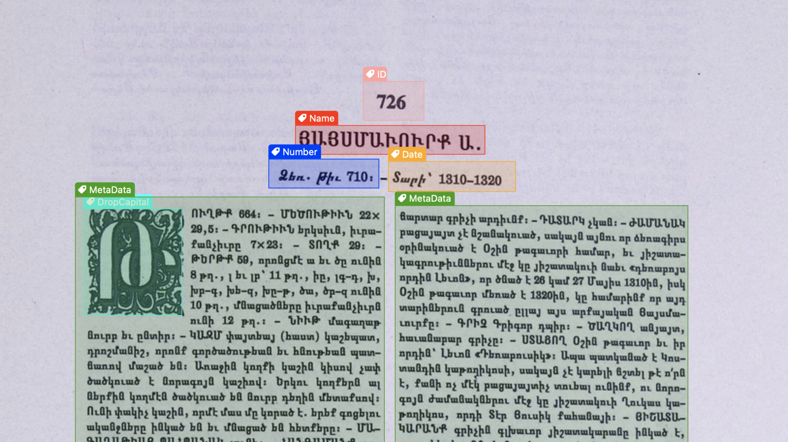
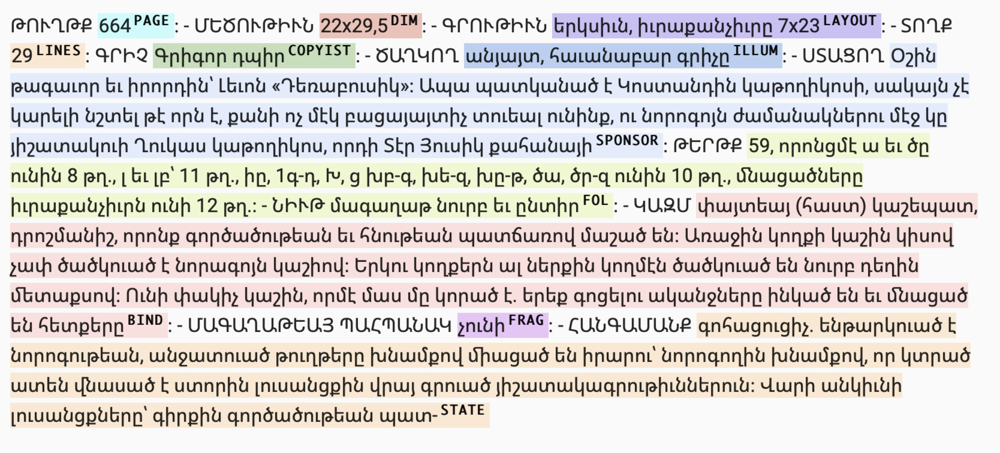

## Catalog of Manuscripts of Venice (Մայր ցուցակ հայերէն ձեռագրաց մատենադարանին Մխիթարեանց ի Վենետիկ)

* 📌 **The catalog**: https://catalog.mechitar.org

* 📰 **Blog post**: https://calfa.fr/blog/47

This repository contains raw bibliographic records of the catalog of Armenian manuscripts from San Lazzaro Island in Venice, published in 8 volumes between 1914 and 1998 by the Mekhitarist Fathers.

The catalog has been digitized by OCR in collaboration with Calfa in order to offer a fully searchable digital version. The online catalog offers a search by keywords as well as by type of writing, place of copy or even named entities. PDF volumes can be found on the site of the [Fundamental Scientific Library of NASRA](http://serials.flib.sci.am/matenagitutyun/test/index.html).

### Methodology and results

The catalog has been extracted with [Calfa OCR for Armenian](https://calfa.fr/ocr). Specialized models of layout analysis have been developped to extract visual components of each bibliographic records.

<p style="text-align:center;">

</p>

A second step involving a name-entity recognition model has been applied to extract proper names, toponyms, and any semantic information.

<p style="text-align:center;">

</p>

One of the major obstacles was to work with old scans of poor quality. Despite some blurred areas and a pixelized text, due to prior compressions of the PDF file, the specialized recognition model for damaged printed Armenian documents reaches a mean accuracy of 99.2%, with common mistakes on ambiguous letters and uppercases. Some lines are also missing. Manual proofreading is ongoing. Main metadata (size of the manuscript, number of pages, etc.) have already been proofread.

### How to contribute

You have identified a typo or a mistake in a bibliographic record? Please open a new issue with the ID of the bibliographic record and the your proofreading.

### Catalog statistics

Ongoing

### Licence

The raw data are distributed under [CC BY-NC 4.0 license](https://creativecommons.org/licenses/by-nc/4.0/) (Attribution-NonCommercial).

### How to cite

If you use this repository in your work, please cite it using the following metadata:

```bibtex
@dataset{Calfa_catalog_Venice,
    author = {Calfa},
    title = {{Catalog of Manuscripts of Venice}},
    url = {https://github.com/calfa-co/catalog-manuscripts-venice},
    year = {2024}
}
```

### Acknowledgments

This work was carried out with the support of the Mekhitarists, using the PDF of the Fundamental Scientific Library of NASRA.

 